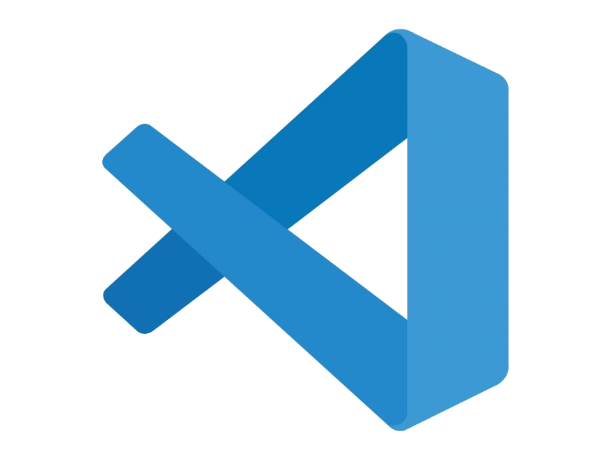

# Hey there, I'm [Ethan](https://ethan-master-coding.github.io/My-work/) 👋

- 🔭 I’m currently working on learning CS
- 🌱 I’m currently learning CS
- 👯 I’m looking to collaborate on my unit converter
- 🤔 I’m looking for help with nothing as of now
- 💬 Ask me about HTML, CSS or American history
- 🥅 2022 goals: Finish the CS and Phaser.js paths on Codecademy.
___

## Contact Me
- Reach me on discord How To Program#9498
- Reach the on the [codecademy forums](https://discuss.codecademy.com/u/ethanmasterprogram/summary)

___

## Languages and Tools:

 

 
 

___

 

___

 
 
 

## 📺 Latest YouTube Videos

<!-- YOUTUBE:START -->
- [Best places to get help with programing in 2022 | How To Program #shorts](https://www.youtube.com/watch?v=HCTumg-MbO8)
- [Top 3 best areas of tech to go into 2022 | How To Program #shorts](https://www.youtube.com/watch?v=vTF-GSOBhm4)
- [Top 3 backend web development languages 2022 | How To Program #shorts](https://www.youtube.com/watch?v=NAzmy1nnm7k)
- [Top 3 IDEs in 2022 | How To Program #shorts](https://www.youtube.com/watch?v=xW6EkjnjEXQ)
- [Best places to learn to program in 2022 | How To Program #shorts](https://www.youtube.com/watch?v=qLV5--VUEUI)
<!-- YOUTUBE:END -->
